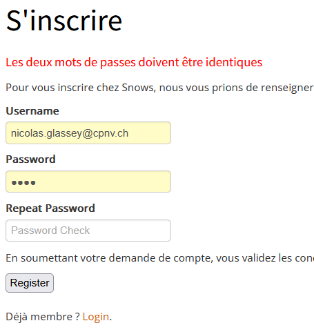

# Backlog Examen Blanc 151

## Modalité d'évaluation

### Prise en main du dépôt
Pour prendre en main ce projet, il vous faut suivre les étapes suivantes :

* "cloner" le dépôt présent à l'adresse suivante [Lien du dépôt](https://github.com/CPNV-151/ExaBlanc.git)
* configurer votre IDE pour pouvoir lancer le site
* modifier les données de l'utilisateur présent dans le dbConnector
* avoir la base de données snows correctement configurée (voir script "refreshSnowsDatabase" dans le répertoire sql)

### Livrable finale
Compresser le projet dans une archive du nom de "151_[NomDeFamille].zip" et transmettez-le à votre enseignant via un message teams privé.

---
## Tâche 1 - Bug fix - simple

Description:

Le menu principal affiche une erreur de sythaxe. Le menu présente l'option "snow" alors que "snows" devrait être affiché.

* Actuellement

* Souhaité

---
## Tâche 2 - Bug fix - moyen

### Description

La page de login devrait permettre de naviguer sur la page d'inscription (register), mais pour l'instant cela redirige vers la page "home".

|Actuellement   | Souhaité  |
|:-:|---|
||   |

---
## Tâche 3 - Enrichissement fonctionnel simple

### Description

La page de login de présentation d'un snowboard devrait afficher le modèle du snowboard, mais pour l'instant seule la marque s'affiche.

|Actuellement   | Souhaité  |
|:-:|---|
|| |

---
## Tâche 4 - Enrichissement fonctionnel moyen

### Description

Lors d'une tentative d'inscription (register), un seul message regroupe tous les types d'erreurs. Nous aimerions afficher un message différent si les deux mots de passes ne sont pas identiques.

|Actuellement   | Souhaité  |
|:-:|---|
|||
